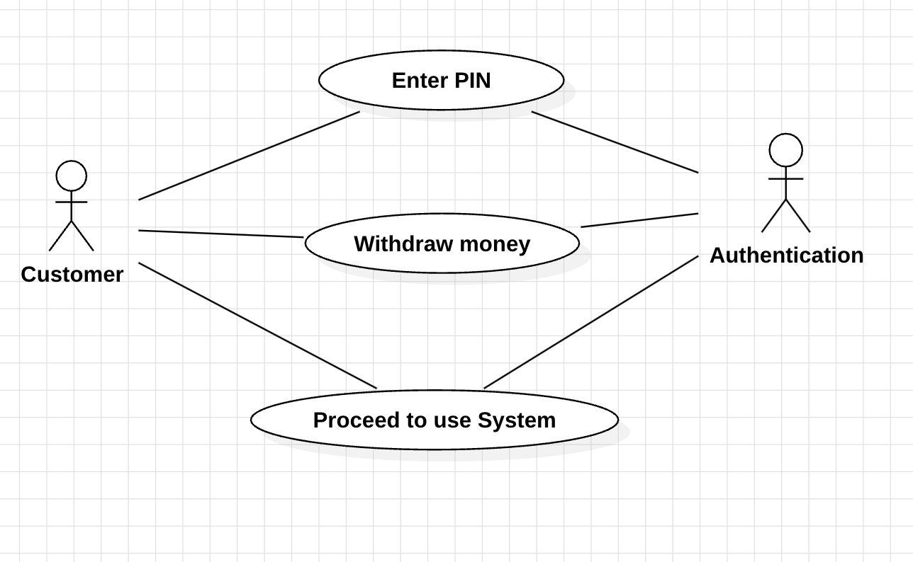
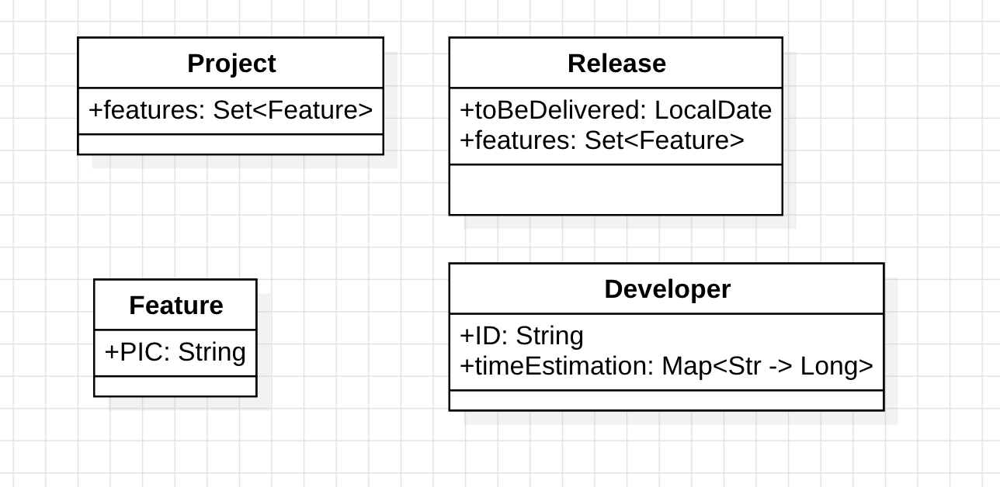
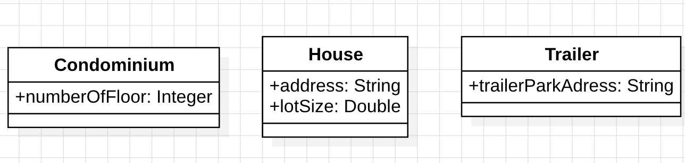

# Lab 1

## 1

| User Action | System Response |
|----------|----------|
| 1. User type in PIN into main screen    | System checks validity of PIN and presents options to user on another screen    |
| 2. User selects the account type(checking or debit account) types the amount of money he wants to witdraw   | System checks if the corresponding account has enough money to withdraw and do so   |
| 3. After withdraw the money(either succesfully or not) ask the user if he wants to continue interacting with the systems    | Systems receives the answer and will presents the coresponding requested screen    |
## 2

## 3

## 4
