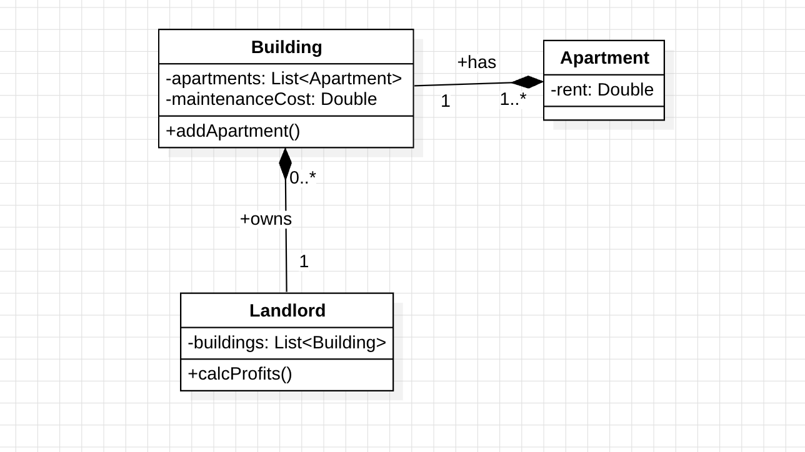
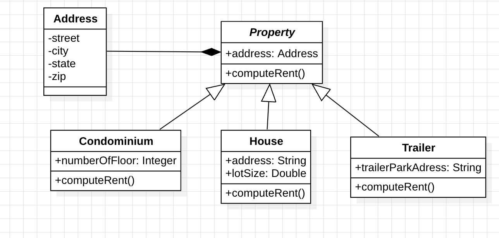

# Lab 3
1. Because, everytime a different `equals()` is triggered one trigger doesn't take into account the salary that's why it returns false, this violates the reflexive rules. [Here](/lab3/lesson03/labs/prob1/) is the suggested fix with composition.

2. Here is the class diagram, please find the code [here](/lab3/lesson03/labs/prob2/)

3. Here is the diagram refactoring the code using inheritance, please find the code [here](/lab3/lesson03/labs/prob3/)
